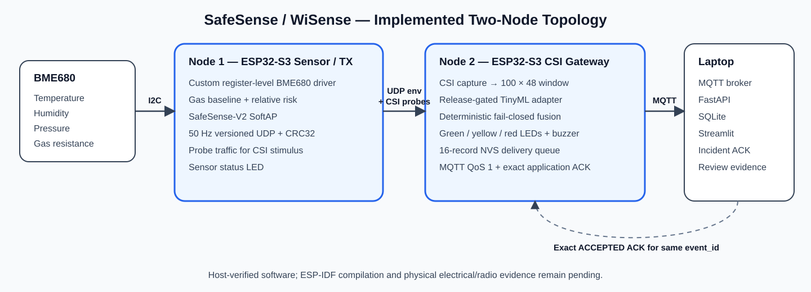
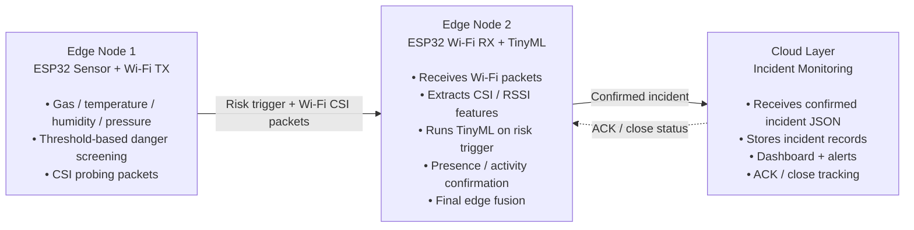

# SafeSense EdgeAI

> **Status: Ongoing academic Edge AI / IoT prototype**

SafeSense is an ESP32-based edge intelligence system exploring **Wi-Fi CSI/RSSI sensing + TinyML + environmental sensor fusion** for privacy-preserving human presence/activity confirmation during environmental risk events.

The design deliberately keeps the first-stage sensing and AI decision path at the edge. Instead of continuously sending raw radio/sensor data to the cloud, SafeSense is designed to send a compact confirmed-incident event only after local risk screening and edge inference.

## Architecture



### High-level flow



More detail: [docs/architecture.md](docs/architecture.md)

## Why this design

- **Edge-first inference:** local decisions reduce dependence on continuous cloud connectivity.
- **Privacy-oriented sensing:** Wi-Fi channel behaviour is used for presence/activity inference rather than cameras.
- **Risk-triggered AI:** the TinyML path is designed to run when the environmental risk gate indicates a meaningful event instead of treating every sample as an emergency.
- **Sensor + radio fusion:** environmental evidence and Wi-Fi-derived presence/activity evidence are combined before escalation.
- **Compact cloud events:** the backend receives structured incident information rather than continuous raw sensing streams.

## Target hardware / software

| Area | Current design |
|---|---|
| Edge compute | ESP32 nodes |
| Radio sensing | Wi-Fi CSI / RSSI features |
| Environmental sensing | Gas, temperature, humidity, pressure |
| Edge intelligence | TinyML presence/activity classifier |
| Device-to-backend | MQTT and/or HTTP JSON events |
| Backend | Incident validation, persistence, deduplication and alert lifecycle |
| Dashboard | Live state, inference confidence and incident status |

> The repository documents an **ongoing prototype**. Items marked in-progress/planned below should not be interpreted as completed production functionality.

## Current engineering status

See [docs/progress.md](docs/progress.md) for the current-vs-planned breakdown.

The present work focuses on the system architecture, ESP32 sensing/data path, Wi-Fi feature pipeline, TinyML integration strategy and edge-to-backend incident flow. Hardware/model validation is ongoing.

## Intended edge data flow

1. Edge Node 1 samples environmental sensors.
2. Deterministic threshold/risk logic evaluates whether a meaningful hazard condition exists.
3. Wi-Fi probing traffic provides CSI/RSSI observations to Edge Node 2.
4. When the risk path is triggered, Edge Node 2 extracts radio features and runs TinyML presence/activity inference.
5. The edge fusion stage combines environmental risk and presence/activity evidence.
6. Only a confirmed incident is formatted as structured JSON and sent to the backend.
7. The backend persists the incident, surfaces it on the dashboard, sends the configured alert and tracks acknowledgement/closure.

## Related completed embedded work

For prior hands-on microcontroller/peripheral work, see **[TrolleyMakers](https://github.com/Ajey95/TrolleyMakers)** — an STM32F401CCU6 smart trolley prototype using RFID over SPI, an I2C LCD, GPIO controls, buzzer feedback and peripheral-driver integration.

## Repository structure

```text
Safesense-EdgeAI/
├── README.md
└── docs/
    ├── architecture.svg
    ├── architecture.md
    └── progress.md
```

## Scope

SafeSense is a student prototype/research build. It is **not a certified safety system**, and sensor thresholds, RF inference accuracy and alert behaviour require controlled experimental validation before any real-world safety-critical use.
