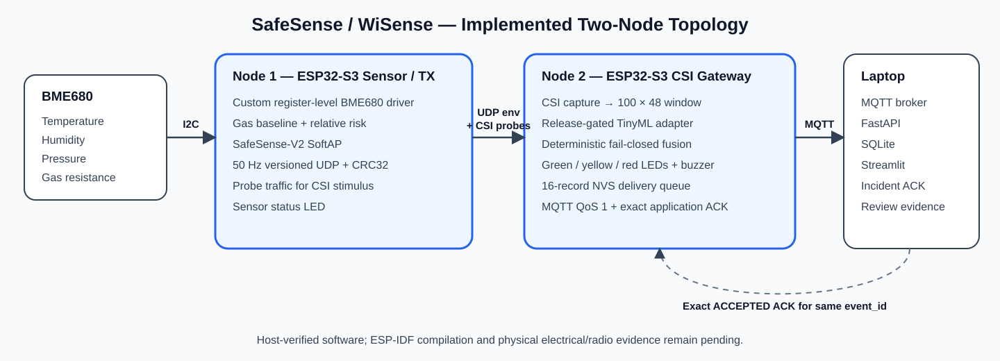

# SafeSense EdgeAI

> **V1 live prototype:** Two classic ESP32 boards have delivered real BME680
> and CSI telemetry end-to-end. The original MQ-135 repeatedly read ADC 0;
> the user reports a working replacement module that needs separate recorded
> ADC/voltage evidence. No activity model or calibrated gas alarm is released.

SafeSense combines environmental sensing, Wi-Fi CSI activity context, deterministic safety fusion, persistent ESP32 delivery, a local FastAPI backend, and a Streamlit operations dashboard. The design is privacy-oriented and fail-closed: uncertain CSI is never treated as proof that a room is vacant, and environmental danger cannot be suppressed by the ML result.

## Architecture



More detail: [architecture](docs/architecture.md), [implementation progress](docs/progress.md), and [review readiness](docs/review_readiness.md).

The new [Forecast Lab](docs/forecast_lab.md) provides a synthetic, held-out-scenario 30-minute TinyML demonstration, a reference-matched themed dashboard at `/forecast`, and a separately labelled physical TX replay path with Wi-Fi and nearby-laptop Bluetooth alert receipts. Run `uvicorn safesense.main:app --host 127.0.0.1 --port 8000` and open `http://127.0.0.1:8000/forecast`.

The [Environmental Forecasting v1 dataset](https://huggingface.co/datasets/Ajeya95/environmental-forecast-v1) contains project-generated **synthetic** time series. Its operational scenarios are supported by cited guidance in the dataset card, but its rows are not physical sensor captures. Live ESP32 readings are a separate demonstration and do not establish real-room forecast accuracy.

The [Live Hardware view](docs/live_hardware_integration.md) at `/forecast?view=live` shows physical sensor readings through direct laptop Wi-Fi, paired laptop Bluetooth, direct USB, or the optional RX bridge when those routes are used. It excludes synthetic scenario replay and labels disconnected or stale readings. Receipt states are shown separately when the corresponding route provides evidence. The [single-board transport runbook](docs/direct_laptop_transport.md) records the direct Wi-Fi and Bluetooth setup and its physical test boundaries.

## Current V1 path

- Custom register-level BME680 driver on TX (I2C `0x76`, GPIO21/22), with live temperature, humidity, pressure and gas resistance.
- MQ-135 AO through a 10 kΩ / 10 kΩ divider to TX GPIO34. The original module repeatedly read raw ADC 0; a replacement is reported working and must be recorded separately. Raw ADC is not ppm or a selective gas alarm.
- TX and RX have separate NVS queues. TX→RX uses HTTP JSON plus exact event-ID ACK; a laptop bridge forwards RX→local FastAPI and ACKs RX only after matching backend acceptance.
- RX receives TX UDP probes and captures CSI. On the classic ESP32 the first four CSI bytes were invalid on every observed packet, so RX masks the affected carrier and reports 47 measured subcarriers in 100-frame diagnostic windows. Activity stays `UNKNOWN`.
- Deterministic edge and backend fusion with explicit `UNKNOWN`, `UNAVAILABLE`, and `DEGRADED` behavior.
- FastAPI ingestion, validation, idempotency, SQLite persistence, incidents, acknowledgement, and WebSocket fan-out.
- Streamlit dashboard with live JSON, HTTP/NVS communication evidence, and a prominent MQ-135 zero-signal warning.
- The older BME280/MQTT applications remain in the repository but are not the current two-board V1 demo. The public-data TinyML candidate remains rejected by its accuracy gate.

## Run locally

```powershell
python -m venv .venv
.\.venv\Scripts\Activate.ps1
pip install -e ".[dev]"
uvicorn safesense.main:app --reload
```

In a second terminal:

```powershell
streamlit run dashboard\app.py
```

In a third terminal, use either the general telemetry simulator or CSI replay:

```powershell
python scripts\simulate_device.py

$env:PYTHONPATH = "src"
python scripts\replay_csi.py
```

For the physical two-board V1 demo, see [RX setup](firmware/node2_csi_gateway/README.md)
and [TX setup](firmware/node1_sensor_tx/README.md). The laptop must temporarily
join RX's Wi-Fi AP to run `scripts/run_rx_bridge_demo.ps1 -RestoreWifiProfile <profile-name>`; that bounded script
restores the named laptop profile afterward. It is not an
unattended continuous bridge.

## Repository structure

```text
dashboard/                    Streamlit review dashboard
docs/                         Architecture, safety and review evidence
firmware/components/          Reusable ESP-IDF drivers and edge components
firmware/node1_sensor_tx/    Current classic-ESP32 BME680/MQ sensor/TX application
firmware/node2_csi_gateway/ Current classic-ESP32 CSI/RX HTTP/NVS gateway
firmware/environmental_node/  Older BME280 → NVS → MQTT prototype
firmware/csi_transmitter/     Controlled Wi-Fi CSI traffic source
firmware/csi_receiver/        CSI capture, preprocessing and guarded inference
ml/                           Preprocessing, augmentation, training and release gates
scripts/                      Simulator, CSI replay and MQTT bridge
src/safesense/                FastAPI, SQLite, fusion and realtime backend
tests/                        Python tests
```

## Verification

```powershell
pytest
mingw32-make -C firmware/tests test
```

Host verification covers the custom drivers, protocol, NVS queue, CSI preprocessing, fusion, API and dashboard. Both V1 applications were also built/flashed with ESP-IDF 6.1 and observed exchanging real events; physical MQ voltage/calibration and target-room activity accuracy remain open.

## Scope

SafeSense is a student prototype, not a certified safety system. Sensor thresholds, physical ESP32 behavior, RF inference accuracy, false-positive/false-negative rates, and alert behavior require controlled target-room validation before real-world safety-critical use.
