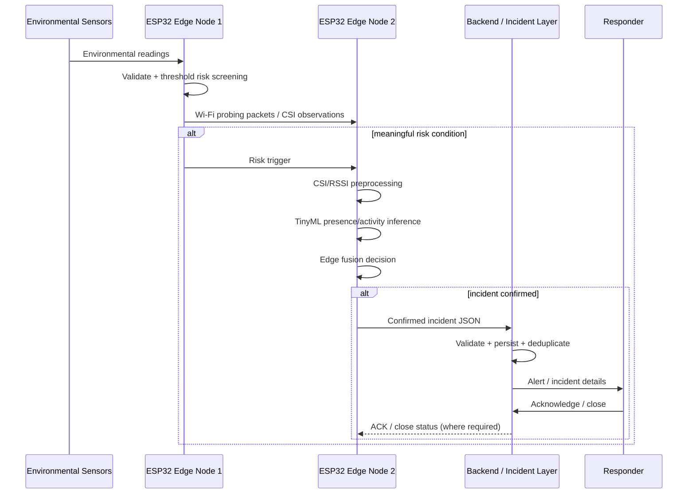

# SafeSense Architecture

SafeSense is designed as a **risk-triggered Edge AI pipeline** with two ESP32 edge nodes and a lightweight cloud incident layer.

## System diagram


## Component responsibilities

### Edge Node 1 — ESP32 Sensor + Wi-Fi TX

This node is responsible for environmental sensing and the first deterministic risk gate.

- Reads environmental sensors such as gas, temperature, humidity and pressure.
- Validates/samples the readings for the risk engine.
- Applies threshold-based danger screening.
- Keeps the Wi-Fi link available and sends probing traffic used by the receiver for CSI/RSSI observations.
- Sends a risk trigger toward Edge Node 2 when the environmental path requires presence/activity confirmation.

### Edge Node 2 — ESP32 Wi-Fi RX + TinyML

This node performs the radio-feature and AI side of the edge decision.

- Receives Wi-Fi packets from the transmitter node.
- Captures/derives CSI and/or RSSI feature windows supported by the experimental setup.
- Preprocesses the radio features for the TinyML model.
- Runs presence/activity inference when the risk path is triggered.
- Returns a confidence-bearing inference result.
- Fuses the environmental risk state with presence/activity evidence before creating a confirmed incident candidate.

### Cloud Layer — Incident Monitoring

The cloud/backend layer is intentionally downstream of the edge decision.

- Receives a structured confirmed-incident JSON event.
- Validates and stores the incident record.
- Applies incident deduplication/lifecycle handling.
- Exposes status to a dashboard.
- Sends the configured alert notification.
- Tracks acknowledgement and closure state.

## Data flow



## Design intent

The project is exploring an architecture in which **raw sensing stays as local as practical** and cloud communication is reserved for structured incident information. This is intended to reduce unnecessary network traffic, avoid camera-based presence sensing, and keep the hazard-to-confirmation path available even when cloud connectivity is imperfect.

## Communication model

Planned device-to-backend interfaces use **MQTT and/or HTTP over a local/IP network**, with structured JSON events. Short backend outages should be handled with bounded buffering/retry rather than losing every event or creating duplicate alert storms.

Example incident shape (illustrative contract, not a finalized production schema):

```json
{
  "areaId": "chem-lab-2",
  "timestamp": "2026-08-28T12:00:00Z",
  "environmentRisk": "CRITICAL",
  "presence": {
    "detected": true,
    "activity": "walking",
    "confidence": 0.94
  },
  "decision": "CONFIRMED_INCIDENT"
}
```

## Reliability / safety boundaries

SafeSense is an ongoing student prototype. The design therefore separates deterministic environmental screening from probabilistic TinyML inference and treats the model as **supporting evidence**, not as a certified safety authority. Sensor calibration, CSI feature robustness, model accuracy, false-positive/false-negative rates and alert behaviour require controlled validation before any safety-critical deployment.
