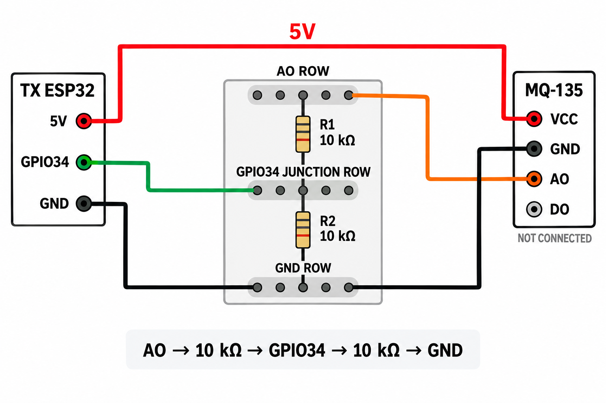

# V1 classic-ESP32 sensor/TX node

This is the V1 TX application for the connected classic ESP32, BME680, and
MQ-135 AO. It is separate from the older `environmental_node` MQTT prototype.
The BME680 register protocol and compensation are implemented by the project's
own `components/bme680` library; no external sensor library is linked here.

## Verified wiring and signals

| Signal | TX ESP32 | Current evidence |
|---|---|---|
| BME680 SDA / SCL | GPIO21 / GPIO22 | Chip ID `0x61` at I2C `0x76`; live temperature, humidity, pressure and gas-resistance readings |
| MQ-135 AO | 10 kΩ from AO to GPIO34, 10 kΩ from GPIO34 to GND | Original module: ADC1 channel 6 read `0` repeatedly. User reports a working replacement; its raw range/voltage needs a separate recorded check. Neither is calibrated ppm. |
| Ground | Shared by ESP32 and sensors | Required for I2C and analog reference |

Breadboard-row schematic for the MQ-135 divider (follow the printed pin labels
on your actual boards; module pin positions can vary):



The BME680 adapter reads the calibration block beginning at `0x89`, skips the
leading byte, validates nonzero primary trim parameters, and rejects invalid
measurements. This start address was verified on the attached module after an
`0x8A`-aligned read intermittently returned zero temperature trim and a false
0 °C output. The corresponding portable mapping and validation are host-tested.

## TX behavior

Every sample is encoded as bounded JSON with a stable random `event_id`, TX
device ID, sequence, BME680 readings (gas resistance in ohms), raw MQ-135 ADC,
and `gas_risk: "UNAVAILABLE"`. No ppm, IAQ, or calibrated MQ risk is inferred.
The JSON is committed to the 16-record NVS queue before HTTP transmission.
Only a successful HTTP 200/202 response with an exact
`{"event_id":"...","status":"ACCEPTED"}` application ACK removes the head
record. Otherwise the record remains pending and is retried. When Wi-Fi is
ready, UDP packets to RX port 3333 provide traffic for CSI capture. Live RX
logs confirmed UDP receipt, 128-byte CSI callbacks, and masked diagnostic
100-frame windows; no activity classification is claimed.

On the first boot of the corrected BME680 calibration driver, a versioned
migration discards only the pre-fix `sstx` test queue, because those entries
could contain false 0 °C measurements. It does not erase the whole NVS
partition, and later boots preserve the corrected queue. A raw backup of the
pre-migration NVS partition was saved outside the repository during the 2026-09-24
hardware test.

During a prior RX-full/stack-overflow run, a read-only NVS audit found one
missing queue-head blob while the other 15 slots remained present. The
current TX firmware skips only an `NVS_NOT_FOUND` head at boot and logs the
recovery; it does not erase the surviving records. Its main-task stack was
increased for nested HTTP/NVS operations and the live queue subsequently
drained to RX.

## Build and configuration

From this directory, in an ESP-IDF 6.1 PowerShell environment:

```powershell
idf.py set-target esp32
idf.py menuconfig
idf.py build
idf.py -p COM11 flash monitor
```

The checked-in `sdkconfig.defaults` now targets the lab RX AP and its
`192.168.4.1` HTTP/UDP endpoints. Change those values for another network;
the lab password is not suitable for deployment. Keep the generated
`sdkconfig` private (it is git-ignored). COM11 is the
TX board observed in this hardware session, not a portable port number.

Host tests: `mingw32-make -C firmware/tests test` from the repository root.
The physical TX-to-RX HTTP ACK, RX NVS receipt, UDP CSI capture, and
backend/dashboard event match were demonstrated on 2026-09-24. MQ-135 AO
was raw ADC 0 on the original module. The user reports a working replacement,
which must be tested and labelled as a distinct sensor before any gas claim.

## Synthetic forecast and nearby Bluetooth alert extension

The separate [Forecast Lab](../../docs/forecast_lab.md) trains a small dense
model on synthetic BME680/MQ histories, exports the same weights for TX C
inference, and provides an optional UART0 scenario replay mode. The TX hosts a
Bluetooth Classic SPP alert server for a paired nearby laptop. A laptop receipt
means its journal stored the event; it does not prove voice playback or backend
storage. The UART demo fault flag skips the HTTP send and is not an RF fault.
